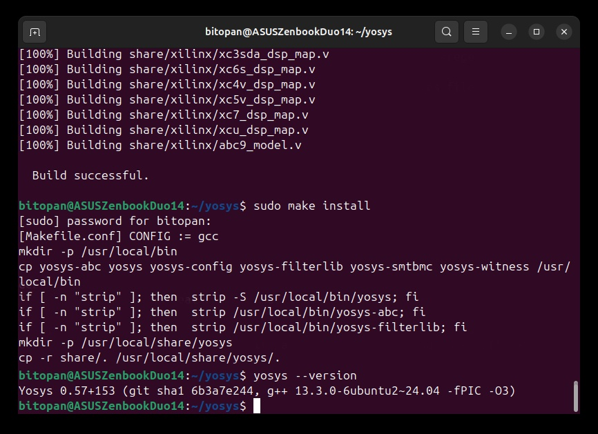
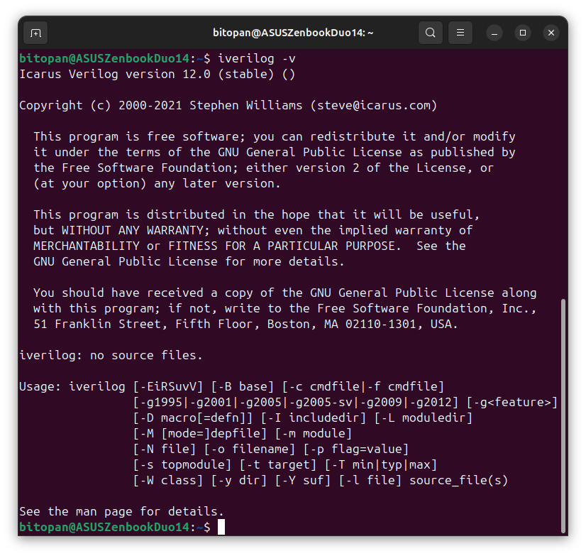
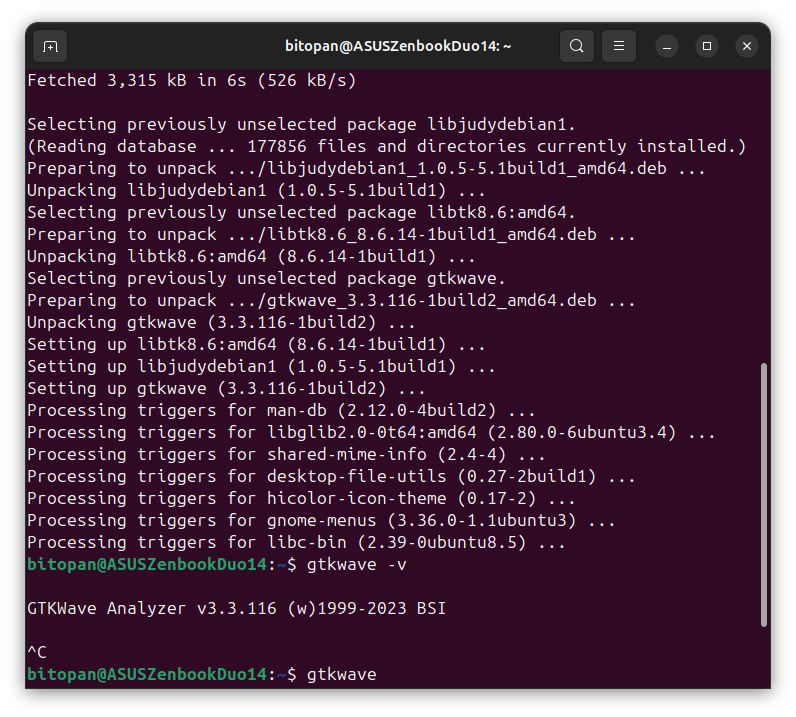

# Week 0: Environment Setup & Installation of Tools.
 
The focus of this week is on **installing and verifying the required tools** in a Linux environment.

---

## 📑 Objectives
- Install the following tools:
    * Oracle VirtualBox (for running Linux)
    * Yosys
    * Iverilog
    * GTKWave
- Verify successful installation and environment setup.
- Document the process with clear steps, logs, and screenshots.

---

## 🛠️ Installation Steps
<details>
  <summary>Oracle VirtualBox</summary>
 
We need to install the Oracle VirtualBox for running the Linux environment in Windows or MAC OS.

🔗 [Download VirtualBox from here.](https://www.virtualbox.org/wiki/Downloads)

We also need to download the Ubuntu ISO file for installation in Oracle VirtualBox.

🔗 [Download Ubuntu from here.](https://ubuntu.com/download/desktop)

  Then setup the following system in VirtualBox:
  - Ubuntu 20.04+
  - 6GB RAM, 50 GB HDD
  - 4vCPU
</details>

<details>
 <summary>Yosys</summary>
 Run the following commands in the terminal:
 
 ```
sudo apt-get update 
git clone https://github.com/YosysHQ/yosys.git 
cd yosys 
sudo apt install make (If make is not installed please install it)  
sudo apt-get install build-essential clang bison flex libreadline-dev gawk tcl-dev libffi-dev git graphviz xdot pkg-config python3 libboost-system-dev libboost-python-dev libboost-filesystem-dev zlib1g-dev
make config-gcc 
make  
sudo make install
 ```
 To verify successful installation, run:

```
yosys --version
```
Output after installation looks like this:


</details>

<details>
 <summary>Iverilog</summary>
 Run the following commands in the terminal:
 
 ```
sudo apt-get update 
sudo apt-get install iverilog 
 ```
 To verify successful installation, run:

```
iverilog -v
```
Output after installation looks like this:


</details>

<details>
 <summary>GTKWave</summary>
 Run the following commands in the terminal:
 
 ```
sudo apt-get update 
sudo apt install gtkwave 
 ```
 To verify successful installation, run:

```
gtkwave -v
```
Output after installation looks like this:


</details>


---


## ⚠️ Challenges

1. **Errors during Yosys installation:** While executing the installation commands for Yosys, certain errors may arise due to different reasons.
In my case, the issue was caused by the improper initialization of a Git submodule during the cloning of the Yosys repository.
This was resolved by searching the error message online (specifically using ChatGPT), which provided the appropriate guidance.
It is important to note that similar or entirely different errors may occur on other devices, depending on their individual configurations. In such cases, it is advisable to carefully review the error message and search for relevant solutions before proceeding further.
2. **Installation time:** The installation process of Yosys requires a considerable amount of time. Users should remain patient and allow the process to complete without interruption.


---


## 🏁 Final Remarks

The completion of Week 0 marks the successful setup of the development environment required for the program.

This week primarily focused on:

- Installation of the essential tools,
- Verifying proper configurations, and
- Documenting the entire process for reproducibility.

Although certain challenges were encountered during the setup, they provided valuable learning experiences in debugging and problem-solving within a Linux environment.

>[!NOTE]
> For easy navigation to all the weeks of the program, please visit the [Master Repository](https://github.com/BitopanBaishya/VSD-Tapeout-Program-2025.git).
